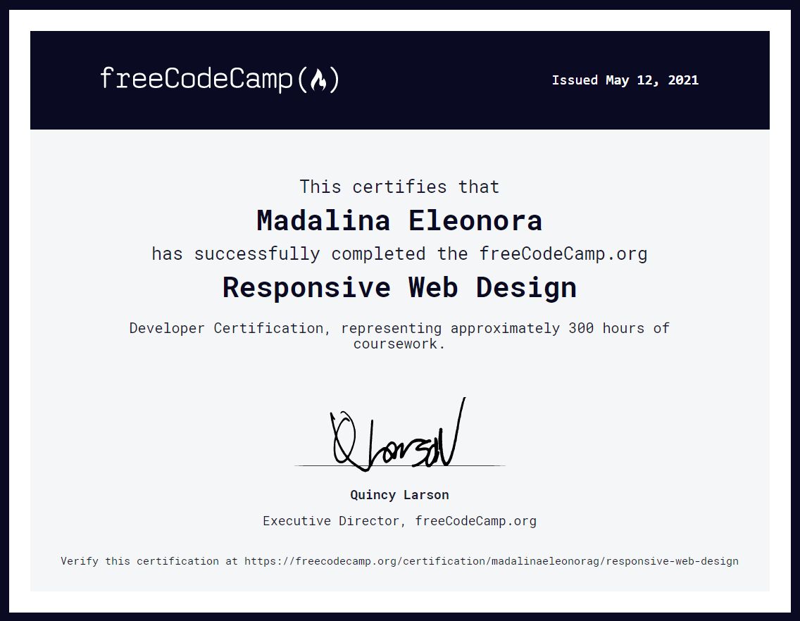
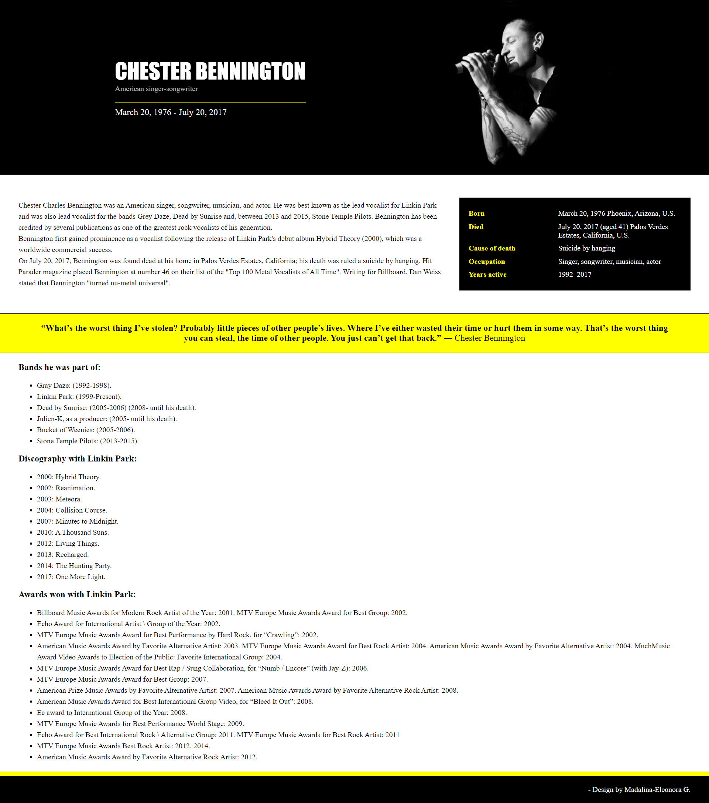
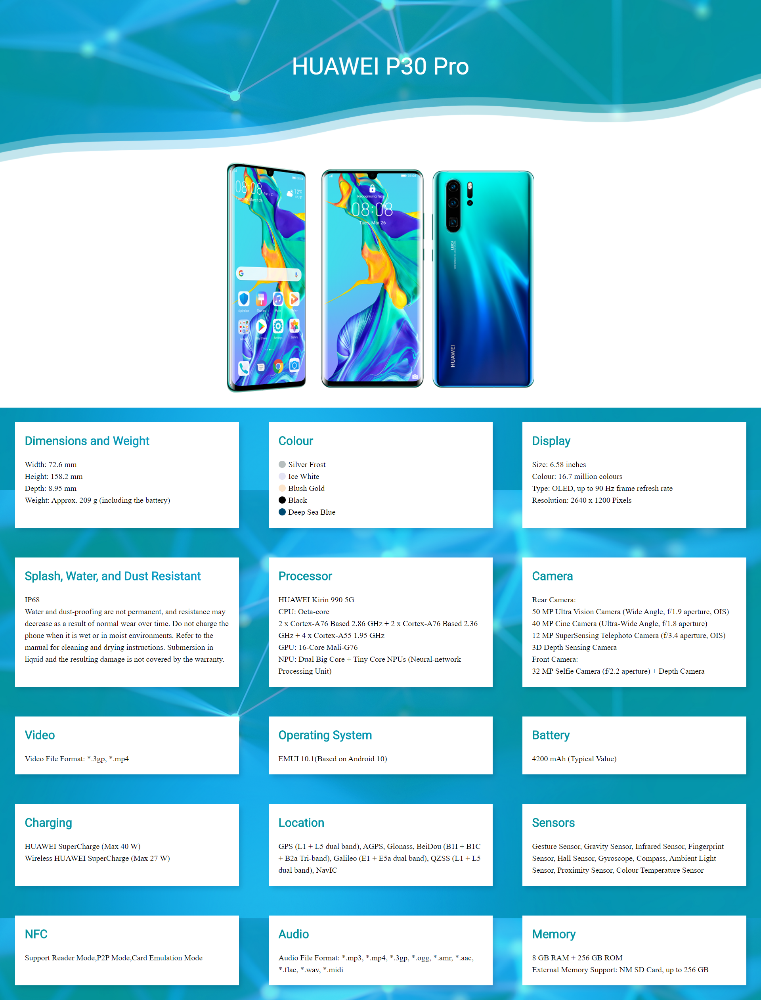
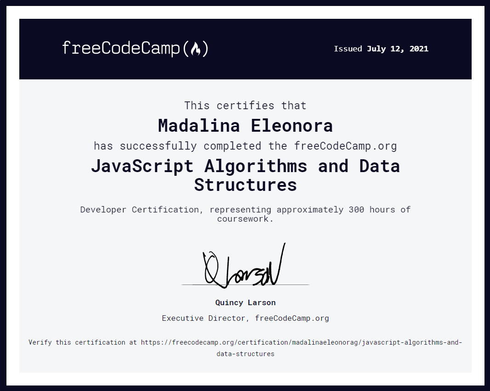
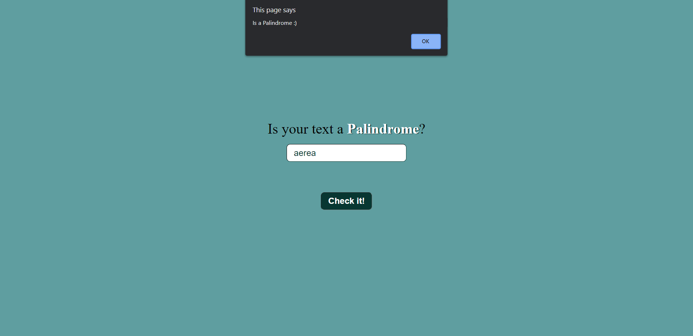
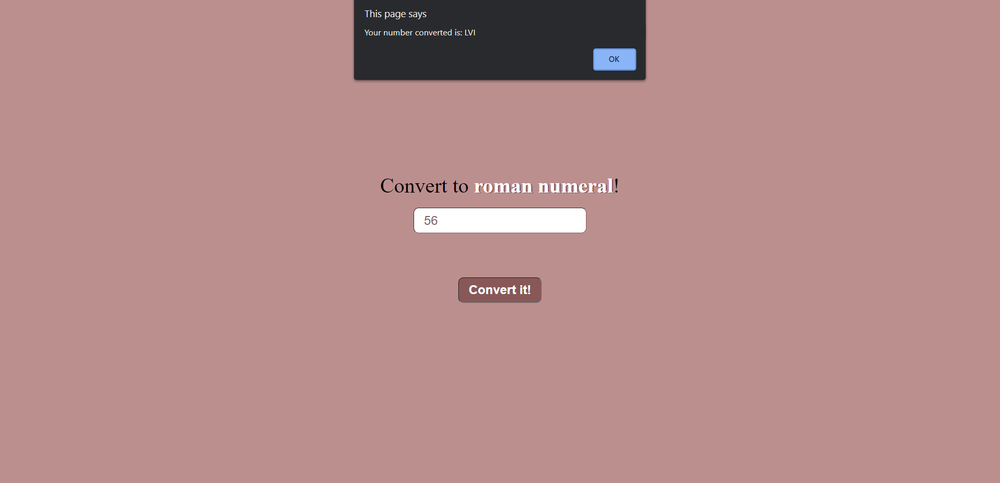
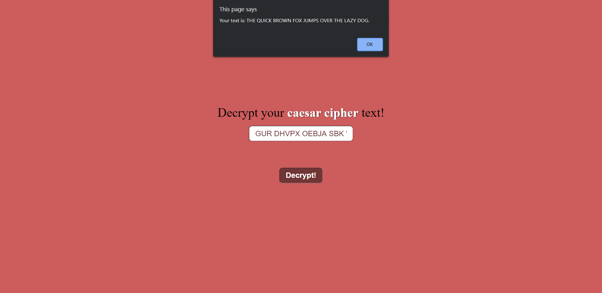
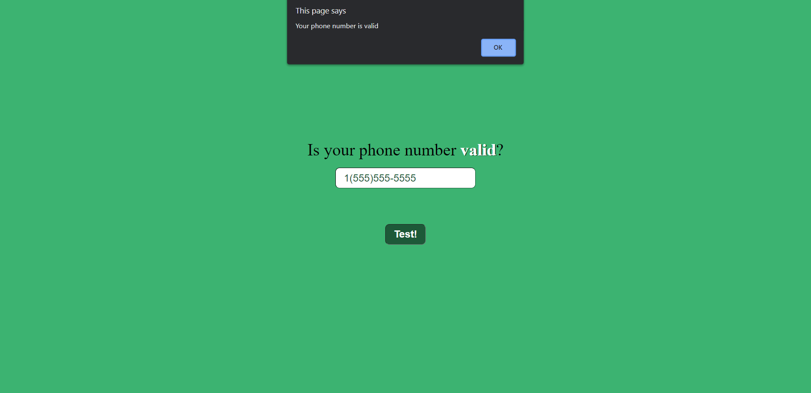
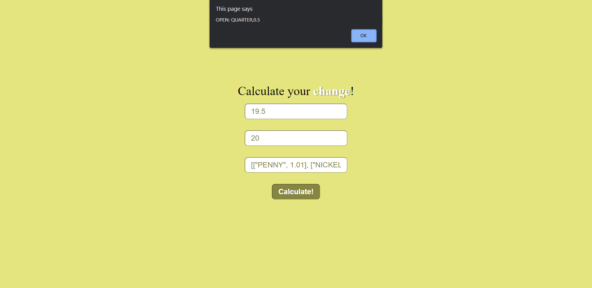

Projects made by following the courses from FreeCodeCamp.com

This includes:
* Responsive Web Design Certification (300 hours)
* * Basic HTML and HTML5
* JavaScript Algorithms and Data Structures Certification (300 hours)
* Front End Development Libraries Certification (300 hours)
* Data Visualization Certification (300 hours)
* APIs and Microservices Certification (300 hours)
* Quality Assurance Certification (300 hours)
* Scientific Computing with Python Certification (300 hours)
* Data Analysis with Python Certification (300 hours)
* Information Security Certification (300 hours)
* Machine Learning with Python Certification (300 hours)
* Coding Interview Prep (Thousands of hours of challenges)

# Responsive Web Design Certification Projects
 

* Tribute page 
    
* Form page 
    
* Landing page 
    
* Technical page 
    
* Portfolio page 
    
# JavaScript Algorithms and Data Structures Projects

* Palindrome checker 
    
* Roman numeral converter 
    
* Caesars cipher 
    
* Phone validator 
    
* Cash register 
    
