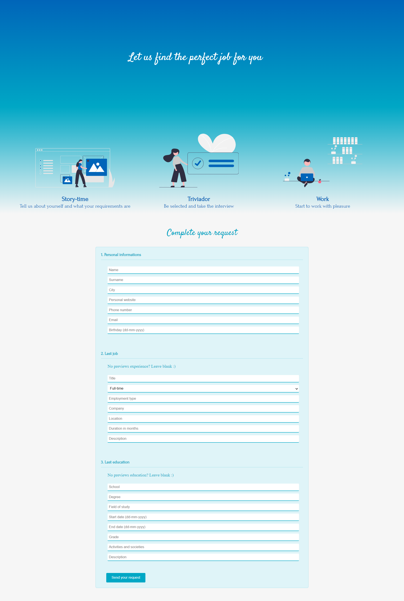

Projects made by following the courses from FreeCodeCamp.com
# Responsive Web Design Certification Projects
 

* Tribute page 
    
* Form page 
    
* Landing page 
    
* Technical page 
    
* Portfolio page 
    
# JavaScript Algorithms and Data Structures Projects

* Palindrome checker 
    
* Roman numeral converter 
    