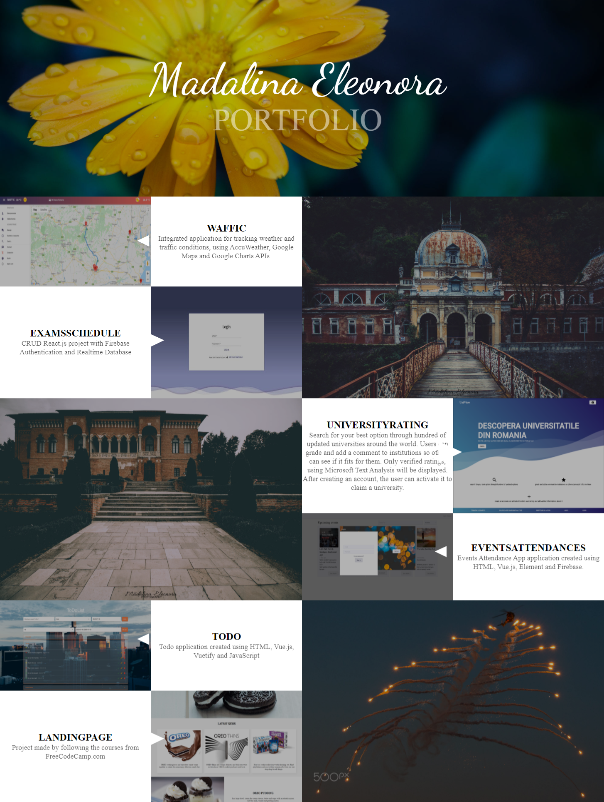

Projects made by following the courses from [FreeCodeCamp](https://www.freecodecamp.org)

Check my progress [HERE](https://www.freecodecamp.org/madalinaeleonorag)

This includes:
* Responsive Web Design Certification (300 hours) ✔️
  * Basic HTML and HTML5 🗸
  * Basic CSS 🗸
  * Applied Visual Design 🗸
  * Applied Accessibility 🗸
  * Responsive Web Design Principles 🗸
  * CSS Flexbox 🗸
  * CSS Grid 🗸
* JavaScript Algorithms and Data Structures Certification (300 hours) ✔️
  * Basic JavaScript 🗸
  * ES6 🗸
  * Regular Expressions
  * Debugging 🗸
  * Basic Data Structures 🗸
  * Basic Algorithm Scripting
  * Object Oriented Programming 🗸
  * Functional Programming
  * Intermediate Algorithm Scripting
* Front End Development Libraries Certification (300 hours)
  * Bootstrap
  * jQuery
  * SASS
  * React
  * Redux
  * React and Redux
* Data Visualization Certification (300 hours)
  * Data Visualization with D3
  * JSON APIs and AJAX
* APIs and Microservices Certification (300 hours)
  * Managing Packages with NPM
  * Basic Node and Express
  * MongoDB and Mongoose
* Quality Assurance Certification (300 hours)
  * Quality Assurance and Testing with Chai
  * Advanced Node and Express
* Scientific Computing with Python Certification (300 hours)
  * Python for Everybody
* Data Analysis with Python Certification (300 hours)
  * Data Analysis with Python
  * Numpy
* Information Security Certification (300 hours)
  * Information Security with HelmetJS
  * Python for Penetration Testing
* Machine Learning with Python Certification (300 hours)
  * Tensorflow
  * How Neural Networks Work
* Coding Interview Prep (Thousands of hours of challenges)
  * Algorithms
  * Data Structures
  * Take Home Projects
  * Rosetta Code
  * Project Euler

# Responsive Web Design Certification Projects
 

* Tribute page 
    
* Form page 
    
* Landing page 
    
* Technical page 
    
* Portfolio page 
    

# JavaScript Algorithms and Data Structures Projects

* Palindrome checker 
    
* Roman numeral converter 
    
* Caesars cipher 
    
* Phone validator 
    
* Cash register 
    
